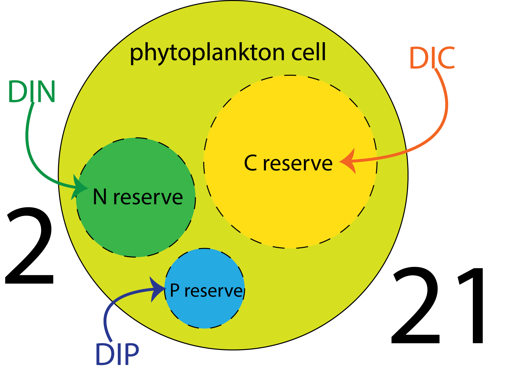

.. 2021 Phytoplankton Physiology Seminar documentation master file, created by
   sphinx-quickstart on Mon Aug 16 16:36:00 2021.
   You can adapt this file completely to your liking, but it should at least
   contain the root `toctree` directive.

Welcome to the Fall 2021 Phytoplankton Physiology Seminar!
==========================================================

.. toctree::
   :maxdepth: 2
   :caption: Contents:
   
   course-logistics.md
   week-one.md
   week-two.md
   week-three.md
   week-four.md
   week-five.md
   week-six.md
   week-seven.md
   week-eight.md
   week-nine.md
   week-ten.md
   week-eleven.md
   week-twelve.md

Required readings
-----------------

Session 0
#########

Session 1: Light Harvesting
###########################
| :download:`Geider 1987 <../_literature/session1/geider1987.pdf>`
| :download:`Cullen 1990 <../_literature/session1/cullen1990.pdf>`

Session 2: Nutrient Acquisition
###############################
| :download:`Geider 2002 <../_literature/session2/geider2002.pdf>`
| :download:`Morel 2008 <../_literature/session2/morel2008.pdf>`

Session 3: Modeling Primer
##########################
| :download:`Flynn 2016 <../_literature/session3/flynn2016.pdf>`

Session 4: Introducing the Large-Scale
######################################
| :download:`Finkel 2009 <../_literature/session4/litchman2015.pdf>`
| :download:`Finkel 2006 <../_literature/session4/finkel2006.pdf>`

Session 5: Mixotrophy
#####################
| :download:`Ward 2015 <../_literature/session5/ward2015.pdf>`
| :download:`Caron 2016 <../_literature/session5/caron2016.pdf>`

Session 11
##########

PDFs and resources across the course pages
------------------------------------------

Session 0
#########

Session 1
#########
:download:`Geider 1987 <../_literature/session1/geider1987.pdf>`
:download:`Cullen 1990 <../_literature/session1/cullen1990.pdf>`
:download:`Hofmann 2021 <../_literature/session1/hofmann2021.pdf>`
:download:`Kiefer 1991 <../_literature/session1/kiefer1991.pdf>`

Session 2
#########

Session 3
#########
:download:`Fiksen 2013 <../_literature/session3/fiksen2013.pdf>`
:download:`Sommer 1990 <../_literature/session3/sommer1990.pdf>`

Session 4
#########
:download:`Finkel 2009 <../_literature/session4/litchman2015.pdf>`
:download:`Finkel 2006 <../_literature/session4/finkel2006.pdf>`

Indices and tables
==================

* :ref:`genindex`
* :ref:`modindex`
* :ref:`search`
